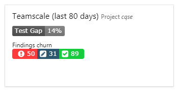
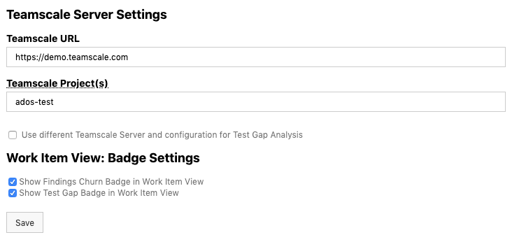

The Teamscale DevOps Extension was designed to integrate results of Source Code Analyses and Test Analyses of a [Teamscale](https://www.teamscale.com/) Instance to Azure DevOps and provides a build step that uploads coverage recorded during test execution in the build to a Teamscale server.

Analyses results are integrated into
* Azure DevOps Work Items as Test Gap- and Findings Churn Badges
* Azure DevOps Dashboards as Dashboard Widget
* Azure DevOps Pull Request as Tab including results of a Teamscale Delta Analysis between two branches

## Work Item Integration
If development in the project is done Work Item (Ticket) based, one can get an overview how many Teamscale Findings are introduced with a Work Item and if testing information are available also how thoroughly changes are tested.

## Dashboard Widget
The Dashboard Widget can be configured to display a Findings Churn Badge and a Test Gap Badge for the corresponding Azure DevOps project.
Integration on the dashboard gives a quick overview how the project evolves since a baseline or for the last days or months.

## Pull Request Integration
Feature branch develop is common in many projects. The integration of Teamscale findings in the Azure DevOps Pull Request allows to see how many Findings would be added to the main line of the repository if the Pull Request is accepted.

## Setting things up
After installing this extension it can be configured on Organization and Project level.

The configuration page is reached from the lower left corner of Azure DevOps, showing either "Organization Settings" or "Project Settings". Choose "Extensions" -> "Teamscale" in the middle bar.

### Organization settings
You can define a "Contact e-mail address" here, which will appear to users in case of connectivity or other problems regarding the Teamscale Extension.

### Project settings
Add the address of your Teamscale server here. For the integration in Azure DevOps Pull Requests and Work Items, specify the name of the Teamscale project for the current Azure DevOps project.

In some development environments a separate Teamscale server is operated for the Test Gap Analysis (TGA) beside a Teamscale server for Source Code Analyses. If so you can specify the second Teamscale server for TGA here.

More than one project can be specified in the "Project" field, in case an Azure DevOps projects correspond to more than just one Teamscale project. Information is then tried to gathered starting from the first project in the list to the further ones and retrieved from the first Teamscale project in that relevant information for the query exists. 

